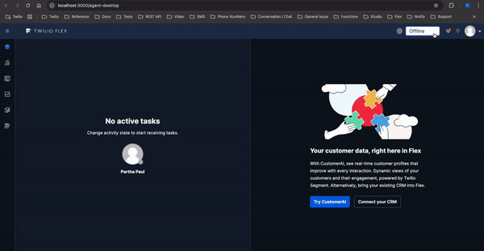

# Flex Plugin to replace the default Worker Activity Dropdown


# Demo



## How to Add the Activity SID to Your Project

1. **Collect the Activity SIDs from Twilio TaskRouter**

   To get the `activitySid` values, follow these steps:

   - Log in to your **Twilio Console** at [https://www.twilio.com/console](https://www.twilio.com/console).
   - Navigate to **TaskRouter** under **Programmable Chat** or search for **TaskRouter** in the search bar.
   - Select the **Workspace** that you are using in your Flex application.
   - In the **TaskRouter Dashboard**, find the **Activities** section, where you can view and manage activity states.
   - Each activity will have a unique `activitySid`. Click on each activity to copy its `SID` or copy it directly from the TaskRouter API response.
   
   You will need the `activitySid` values for the following activity states:
   - Available
   - Unavailable
   - Break
   - Offline

2. **Create the `.env` File**  
   In the root directory of your React project, create a file named `.env`.

3. **Add the Environment Variables**
    
   Open the `.env` file and add the following lines to define the activity states for your application. Replace the placeholder `your_activity_sid_here` with 
   the actual `activitySid` values you collected from Twilio TaskRouter:

   ```env
   REACT_APP_ACTIVITY_SID_AVAILABLE=your_available_activity_sid_here
   REACT_APP_ACTIVITY_SID_UNAVAILABLE=your_unavailable_activity_sid_here
   REACT_APP_ACTIVITY_SID_BREAK=your_break_activity_sid_here
   REACT_APP_ACTIVITY_SID_OFFLINE=your_offline_activity_sid_here
   ```
   
5. **Save the File**
   
   After adding the environment variables, save the `.env` file.


## How to Test Locally and Deploy to Flex

### 1. **Test the Application Locally**

Follow the instructions below to test your application locally:

1. **Ensure Environment Variables are Set**
   
   Make sure you've added the correct `activitySid` values to your `.env` file.

3. **Install Dependencies**
   
   Install the required dependencies by running:
   
   - If you're using `npm`:
     ```bash
     npm install
     ```
   - If you're using `yarn`:
     ```bash
     yarn install
     ```

5. **Start the Local Development Server**
   
   Once you have created your plugin development environment, you can navigate into your plugin's code directory and start Flex:
   
     ```bash
     cd custom-dropdown
     twilio flex:plugins:start
     ```

7. **Test the Application**
   
   Visit [http://localhost:3000](http://localhost:3000) and verify that everything is working as expected.

### 2. **Deploy to Twilio Flex**

To learn how to create and deploy your application to Twilio Flex, please refer to the official documentation:

[Twilio Flex Plugin Quickstart](https://www.twilio.com/docs/flex/quickstart/getting-started-plugin)

